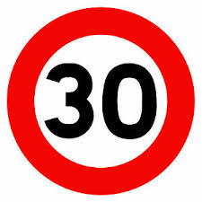

# **Traffic Sign Recognition** 

## Writeup

---

**Build a Traffic Sign Recognition Project**

The goals / steps of this project are the following:
* Load the data set (see below for links to the project data set)
* Explore, summarize and visualize the data set
* Design, train and test a model architecture
* Use the model to make predictions on new images
* Analyze the softmax probabilities of the new images
* Summarize the results with a written report

[//]: # (Image References)

[image1]: ./examples/visualization.jpg "Visualization"
[image2]: ./examples/grayscale.jpg "Grayscaling"
[image3]: ./examples/random_noise.jpg "Random Noise"
[image4]: ./examples/placeholder.png "Traffic Sign 1"
[image5]: ./examples/placeholder.png "Traffic Sign 2"
[image6]: ./examples/placeholder.png "Traffic Sign 3"
[image7]: ./examples/placeholder.png "Traffic Sign 4"
[image8]: ./examples/placeholder.png "Traffic Sign 5"

## Rubric Points
### Here I will consider the [rubric points](https://review.udacity.com/#!/rubrics/481/view) individually and describe how I addressed each point in my implementation.  

---

### Data Set Summary & Exploration

#### 0. Load the data from pickle files

I load the pickled data from the train.p file, valid.p file and test.p file.
Simultaneously, I assign arrays X and y to corresponding 'features' and 'label' of training set, validation set and test set.

#### 1. Provide a basic summary of the data set. In the code, the analysis should be done using python, numpy and/or pandas methods rather than hardcoding results manually.

I used the pandas library to calculate summary statistics of the traffic
signs data set:

* The size of training set is 34799 examples.
* The size of the validation set is 4410 examples.
* The size of test set is 12630 examples.
* The shape of a traffic sign image is (32,32,3).
* The number of unique classes/labels in the data set is 43, which means there are 43 types of unique traffic signs we will work with.

#### 2. Include an exploratory visualization of the dataset.

Here is an exploratory visualization of the data set. It will load a random image in the training set along with its label.
We can check the label associated with sign in the signnames.cvs file. Label '2' means the sign is "Speed limit 50 km/h".

[//]: # (Image References)

### Design and Test a Model Architecture

#### 1. Describe how you preprocessed the image data. What techniques were chosen and why did you choose these techniques? Consider including images showing the output of each preprocessing technique. Pre-processing refers to techniques such as converting to grayscale, normalization, etc. (OPTIONAL: As described in the "Stand Out Suggestions" part of the rubric, if you generated additional data for training, describe why you decided to generate additional data, how you generated the data, and provide example images of the additional data. Then describe the characteristics of the augmented training set like number of images in the set, number of images for each class, etc.)

For processing the data, I only shuffle the data in the set everytime we train the model so that it doesn't recognize any pattern and mess up the accuracy rate. Random training data guarantees the accuracy of training the model.

#### 2. Describe what my final model architecture looks like including model type, layers, layer sizes, connectivity, etc.) Consider including a diagram and/or table describing the final model.

My final model consisted of the following layers:

| Layer         		|     Description	        					| 
|:---------------------:|:---------------------------------------------:| 
| Input         		| 32x32x3 RGB image   							| 
| Convolution 3x3     	| 1x1 stride, valid padding, outputs 28x28x6 	|
| RELU					|												|
| Max pooling	      	| 2x2 stride,  outputs 14x14x6 				|
| Convolution 3x3     	| 1x1 stride, valid padding, outputs 10x10x16 	|
| RELU					|												|
| Max pooling	      	| 2x2 stride,  outputs 5x5x16 				|
| Flatten	      	| Input 5x5x16, outputs 400        			|
| Dropout	      	|         				|
| Fully connected		| Input 400, outputs 120         									|
| RELU					|												|
| Dropout	      	|         				|
| Fully connected		| Input 120, outputs 84         									|
| RELU					|												|
| Dropout	      	|         				|
| Fully connected		| Input 84, outputs 43         									|
| Softmax				|         									|
| Top k				|  k = 5       									|
|						|												|
|						|												|
 

#### 3. Describe how you trained your model. The discussion can include the type of optimizer, the batch size, number of epochs and any hyperparameters such as learning rate.

To train the model, I used my above architecture based on LeNet-5 architecture with my twist and take.
I take advantage of softmax cross entropy with one-hot label logits with batch size of 128 and 60 epochs. I use Adam optimizer with learning rate of 0.0007 for optimization.

#### 4. Describe the approach taken for finding a solution and getting the validation set accuracy to be at least 0.93. Include in the discussion the results on the training, validation and test sets and where in the code these were calculated. Your approach may have been an iterative process, in which case, outline the steps you took to get to the final solution and why you chose those steps. Perhaps your solution involved an already well known implementation or architecture. In this case, discuss why you think the architecture is suitable for the current problem.

My final model results were:
* training set accuracy of 99.9%
* validation set accuracy of 96.1%
* test set accuracy of 94.8%

I chose the LeNet-5 architecture because it was proven to be very efficient, especially in classifying images. However, I couldn't get pass 90% using the original architecture, so I adjust it to make my own architecture.
I added 3 more dropout layers after the flatten layer, 1st fully connected layer and 2nd fully connected layer. This assures the accuracy on the training set and make the network can never rely on any given activation to be present, because they might be squashed at any momment. So, it is forced to learn a redundant representation for everything to make sure that at least some of the information remains. In the end, it makes the model more robust and prevent overfitting, thus improving the performance as the network is forced to take the consensus over an ensemble of networks.
I tuned the learning rate, the number of dropouts in the model, dropout probability (keep_prob), and mu and sigma used for the tf.truncated_normal.
In the end, the final model's accuracy on the training, validation and test set got higher than 94%, which means it's working well.

### Test a Model on New Images

#### 1. Choose seven German traffic signs found on the web. For each image, discuss what quality or qualities might be difficult to classify.

Here are seven German traffic signs that I found on the web:

[//]: # (Image References)

For this speed limit sign, it is rather easy to classify. One possible difficulty might come from the model misreading the number on the sign and take it as another similar one. The traffic signal sign is easy to classify. But the model might still be mistaken this for the general caution sign that possesses the similar feature. The general caution sign is easy to classify. The reason is the same as with the traffic signal sign and also angle of the frame. The priority road sign is rather difficult to classify, since the white peripheral can be misleading to some other feature because of color contrast. The stop sign is diffictul to classify, since the word "stop" can be in different language and not in the training samples. The roundabout is moderate, because the small size of the arrows can be very difficult to detect and difficult to see. The keep right sign is easy to classify, but some background object might interfere with the classification and prediction.

#### 2. Discuss the model's predictions on these new traffic signs and compare the results to predicting on the test set. At a minimum, discuss what the predictions were, the accuracy on these new predictions, and compare the accuracy to the accuracy on the test set (OPTIONAL: Discuss the results in more detail as described in the "Stand Out Suggestions" part of the rubric).

Here are the results of the prediction:

| Image			        |     Prediction	        					| 
|:---------------------:|:---------------------------------------------:| 
| Speed Limit 30km/h Sign      		| Speed Limit 30km/h Sign   									| 
| Traffic Signal Sign     			| Traffic Signal Sign 										|
| General Caution Sign					| General Caution Sign											|
| Priority Road	      		| Priority Road					 				|
| Stop Sign			| Stop Sign      							|
| Roundabout	      		| Roundabout					 				|
| Keep Right			| Keep Right      							|

The model was able to correctly guess 7 of the 7 traffic signs, which gives an accuracy of 100%. This compares favorably to the accuracy on the test set of 94.8%.

#### 3. Describe how certain the model is when predicting on each of the five new images by looking at the softmax probabilities for each prediction. Provide the top 5 softmax probabilities for each image along with the sign type of each probability. (OPTIONAL: as described in the "Stand Out Suggestions" part of the rubric, visualizations can also be provided such as bar charts)

The code for making predictions on my final model is located in the 12th cell of the Ipython notebook.

For the first image, the model is almost absolutely sure that this is a speed limit 30km/h sign (probability of 0.99), and the image does contain a speed limit 30km/h sign. The top five soft max probabilities were

| Probability         	|     Prediction	        					| 
|:---------------------:|:---------------------------------------------:| 
| 0.99         			| Speed Limit 30km/h   									| 
| ~0.00     				| Speed Limit 50km/h 										|
| ~0.00					| Slippery Road											|
| ~0.00	      			| Yield					 				|
| ~0.00				    | Speed Limit 20km/h      							|

For the second image ... 
| Probability         	|     Prediction	        					| 
|:---------------------:|:---------------------------------------------:| 
| 0.99         			| Traffic Signal Sign   									| 
| ~0.00     				| Beware of ice/snow 										|
| ~0.00					| General caution											|
| ~0.00	      			| Keep Right					 				|
| ~0.00				    | Bumpy Road      							|

For the third image ... 
| Probability         	|     Prediction	        					| 
|:---------------------:|:---------------------------------------------:| 
| 1.00         			| General Caution   									| 
| 0.00     				| Speed Limit 20km/h 										|
| 0.00					| Speed Limit 30km/h											|
| 0.00	      			| Speed Limit 50km/h					 				|
| 0.00				    | Speed Limit 60km/h      							|

For the fourth image ... 
| Probability         	|     Prediction	        					| 
|:---------------------:|:---------------------------------------------:| 
| 1.00         			| Priority Road   									| 
| 0.00     				| No Entry 										|
| 0.00					| Yield											|
| 0.00	      			| Traffic Signals					 				|
| 0.00				    | Roundabout      							|

For the fifth image ... 
| Probability         	|     Prediction	        					| 
|:---------------------:|:---------------------------------------------:| 
| 1.00         			| Stop   									| 
| 0.00     				| No Entry 										|
| 0.00					| Speed Limit 120km/h											|
| 0.00	      			| Yield					 				|
| 0.00				    | No Vehicles      							|

For the sixth image ... 
| Probability         	|     Prediction	        					| 
|:---------------------:|:---------------------------------------------:| 
| 0.93         			| Roundabout   									| 
| 0.07     				| Keep Right 										|
| ~0.00					| Go Straight or Left											|
| ~0.00	      			| Turn Left Ahead					 				|
| ~0.00				    | Priority Road      							|

For the seventh image ... 
| Probability         	|     Prediction	        					| 
|:---------------------:|:---------------------------------------------:| 
| 1.00         			| Keep Right   									| 
| 0.00     				| Roundabout 										|
| 0.00					| Yield											|
| 0.00	      			| Speed Limit 20km/h					 				|
| 0.00				    | Speed Limit 30km/h      							|
